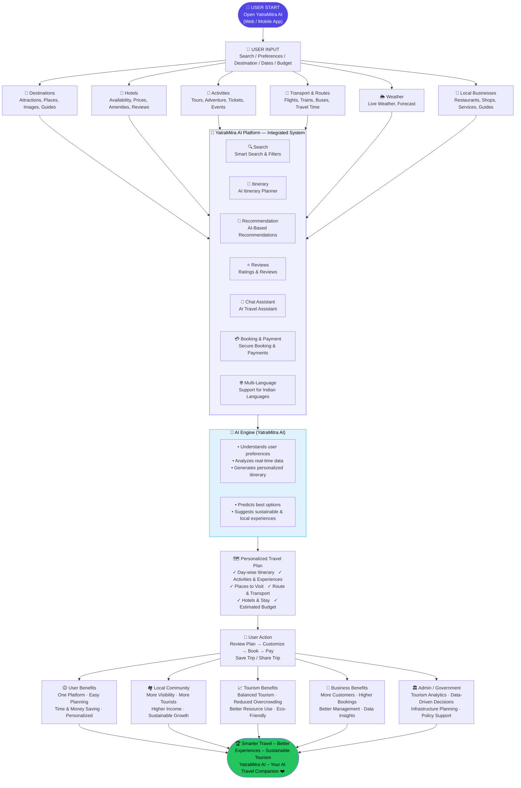
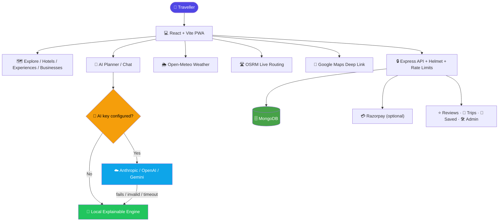
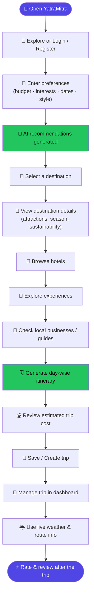
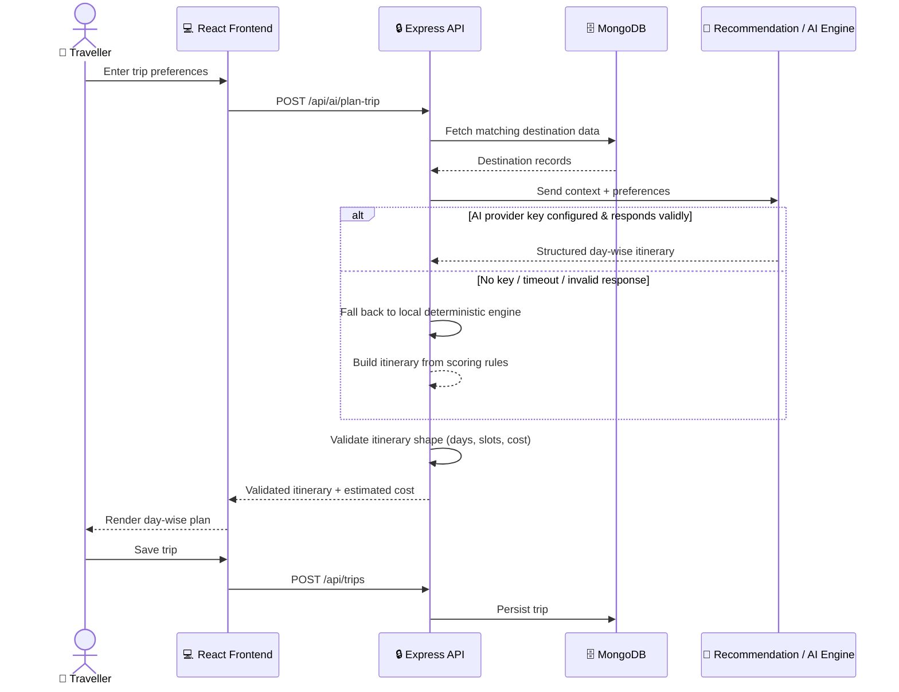
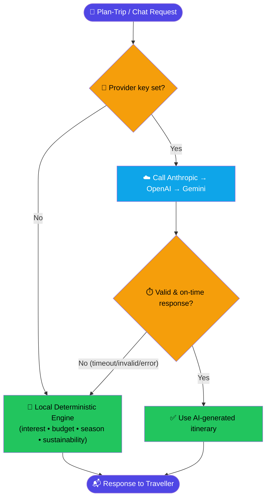

<div align="center">

# 🧭 YatraMitra AI

### 🌏 "Discover Better. Travel Smarter. Support Local."

**An AI-powered, personalized and sustainable tourism ecosystem for India**

🏆 Built for **Smart India Hackathon 2026**

<br>

<!-- Tech stack stickers -->
<p>


</p>
<p>


</p>

<!-- Status / meta stickers -->
<p>


</p>

### 🔗 [Overview](#-1-project-overview) · [Features](#-3-features-implemented) · [Architecture](#-4-architecture) · [Workflow](#-5-project-workflow) · [Setup](#-7-installation) · [API](#-11-api-reference) · [Roadmap](#-16-roadmap--future-scope)

</div>

<br>

| 🏷️ | Details |
|---|---|
| **Problem Statement ID** | `26204` |
| **Title** | Student Innovation — a solution/idea that can boost the current situation of the tourism industries including hotels, travel and others |
| **Organization** | AICTE |
| **Department** | AICTE, MIC — Student Innovation |
| **Category** | 💻 Software |
| **Theme** | ✈️ Travel & Tourism |

<br>

## 📑 Table of Contents

| | | |
|---|---|---|
| 1️⃣ [Project Overview](#-1-project-overview) | 2️⃣ [Problem → Solution → Impact](#-2-problem--solution--impact) | 3️⃣ [Features Implemented](#-3-features-implemented) |
| 4️⃣ [Architecture](#-4-architecture) | 5️⃣ [Project Workflow](#-5-project-workflow) | 6️⃣ [Tech Stack](#-6-tech-stack) |
| 7️⃣ [Installation](#-7-installation) | 8️⃣ [Environment Variables](#-8-environment-variables) | 9️⃣ [Seeding & Running](#-9-seeding--running) |
| 🔟 [Available Scripts](#-10-available-scripts) | 1️⃣1️⃣ [API Reference](#-11-api-reference) | 1️⃣2️⃣ [Badges System](#-12-gamification--badges) |
| 1️⃣3️⃣ [Security](#-13-security) | 1️⃣4️⃣ [The AI Layer](#-14-the-ai-layer--local-engine--optional-llm) | 1️⃣5️⃣ [Known Limitations](#-15-known-limitations) |
| 1️⃣6️⃣ [Roadmap](#-16-roadmap--future-scope) | 1️⃣7️⃣ [Production Checklist](#-17-production-checklist) | 1️⃣8️⃣ [Contributing](#-18-contributing) |
| 1️⃣9️⃣ [License](#-19-license) | | |

---

## 🌍 1. Project Overview

> YatraMitra AI is **not** a static booking website. It's a full-stack platform that fuses an **AI trip planner** 🤖, a **hidden-gem discovery engine** 💎, and a **marketplace for local guides, homestays & experience hosts** 🏘️ — aimed straight at the fragmentation, over-tourism, and low local-business visibility called out in the problem statement.

It understands a traveller's **budget 💰 · interests 🎯 · duration 📅 · group size 👥 · travel style 🧳** to generate a grounded, day-by-day itinerary — while nudging demand toward under-visited destinations and the local businesses around them.

## ⚖️ 2. Problem → Solution → Impact

```mermaid
flowchart LR
    subgraph P ["❌ PROBLEM"]
        direction TB
        P1["📵 Services scattered across apps & word-of-mouth"]
        P2["📋 Planning is generic, same checklist for everyone"]
        P3["🏙️ Popular spots overcrowded, hidden gems undiscovered"]
        P4["👻 Local guides & homestays have zero digital visibility"]
    end
    subgraph S ["✅ SOLUTION"]
        direction TB
        S1["🤖 AI planner builds a real day-by-day itinerary"]
        S2["💎 Engine surfaces hidden-gem alternatives"]
        S3["🏪 Local business marketplace + provider dashboard"]
        S4["🌱 Sustainability score on every destination"]
    end
    subgraph I ["🚀 IMPACT"]
        direction TB
        I1["🗺️ Tourism spreads beyond the same dozen hotspots"]
        I2["💵 Real income visibility for local operators"]
        I3["✨ Personalized plans, not generic top-10 lists"]
    end
    P --> S --> I
```



## ✨ 3. Features Implemented

### 🧭 Planning & Discovery
- ✅ **AI Trip Planner** — multi-step wizard → day-by-day itinerary with per-slot costs, hotel tier & local tips
- ✅ **Save · Regenerate · Share · Export to PDF** (native browser print)
- ✅ **Explainable recommendation engine** — scores by interest overlap, budget fit, seasonality & sustainability, works fully offline
- ✅ **Floating AI chat assistant** grounded in the real destination catalog
- ✅ **Hidden-gem discovery** flags & surfaces under-visited alternatives
- ✅ **Explore / Search / Filter** with weather, attractions & accessibility notes
- ✅ **Hotels & Experiences** discovery + a side-by-side **compare view**

### 🏪 Local Business Ecosystem
- ✅ Public business directory + provider dashboard (add/edit/delete, inquiries, analytics)
- ✅ 💬 One-tap **WhatsApp inquiry** button — no Business API needed
- ✅ 💳 **Razorpay test-mode** payments with automatic WhatsApp fallback

### 👤 Accounts & Platform
- ✅ 🔐 Full JWT auth — register / login / logout, role-based access (`traveler` · `provider` · `admin`)
- ✅ 📊 Admin dashboard — stats, 6-month growth chart, top destinations, business moderation
- ✅ ⭐ Real reviews & ratings, **recalculated live** — never a static seed number
- ✅ 🏅 Gamified badges computed live from real user activity — nothing hardcoded
- ✅ 🌗 Light / dark theme, persisted & system-aware
- ✅ 🌐 **6 languages** — English, हिन्दी, मराठी, বাংলা, தமிழ், తెలుగు
- ✅ 🎙️ Voice input (Web Speech API) in chat & search
- ✅ 🔔 Native browser notifications for key actions
- ✅ 📱 Fully responsive, with skeletons, empty/error states & toasts

### ⚡ Offline & Performance
- ✅ 📲 Installable PWA with app-shell precaching
- ✅ 🔄 Network-first caching for recent API content + runtime photo caching
- ✅ 📡 Built-in offline indicator
- ✅ 🚀 Route-based lazy loading & vendor chunk splitting

## 🏗️ 4. Architecture

### 🗺️ Complete System Flowchart



> This mirrors the project's system-flowchart poster: a single user input fans out across six data domains, all of which feed the integrated platform and its AI engine, producing one personalized plan that benefits travellers, local communities, businesses, tourism at large, and government/admin stakeholders alike.

### ⚙️ Service-Level Architecture (Technical View)



### 📁 Folder Structure

```text
YATRAMITRA-SIH2026/
├── client/                      # ⚛️ React + Vite frontend
│   └── src/
│       ├── components/          # 🧩 common/, cards/, layout/, ai/, visuals/
│       ├── pages/                # 📄 one file per route (+ provider/, admin/)
│       ├── layouts/              # 🖼️ MainLayout, AuthLayout, DashboardLayout...
│       ├── store/                 # 🗂️ zustand: authStore, plannerStore
│       ├── services/               # 🔌 axios API client
│       ├── hooks/                   # 🪝 useVoiceInput, useNotifications
│       ├── context/                  # 🧵 shared React context providers
│       ├── i18n/                      # 🌐 i18next + locales/ (6 languages)
│       ├── animations/                 # 🎞️ Framer Motion variants
│       ├── data/                        # 📦 static fallback/demo data
│       └── utils/                        # 🛠️ constants, badges, image helpers
│
└── server/                      # 🟢 Node + Express backend
    ├── config/                   # ⚙️ DB connection & app config
    ├── controllers/               # 🎮 one per resource
    ├── routes/                     # 🛣️ one per resource
    ├── models/                      # 🗃️ Mongoose schemas
    ├── middleware/                    # 🛡️ JWT guard, error handling
    ├── services/                       # 🧠 AI, recommendations, payments, live travel
    ├── data/                             # 🌱 destinations.js dataset + seed.js
    └── utils/                             # 🔑 token generation & helpers
```

## 🔁 5. Project Workflow

### 🧑‍💻 End-to-End Traveller Journey



### ⚙️ Request Flow — How a Planner Request Is Handled



### 🗂️ Step-by-Step Summary

| # | Step | What Happens |
|---|---|---|
| 1 | **Discover** | User explores destinations or logs in / registers |
| 2 | **Input Preferences** | Budget, interests, travel dates, group size, travel style |
| 3 | **AI Recommendation** | Rule-based engine scores destinations (interest, budget, season, sustainability, hidden-gem bonus) |
| 4 | **Destination Deep-Dive** | User reviews attractions, accessibility & sustainability info |
| 5 | **Cross-Explore** | Hotels, experiences and local businesses for that destination |
| 6 | **Itinerary Generation** | External LLM (Claude/OpenAI/Gemini) attempts a day-wise plan; local engine is the automatic fallback |
| 7 | **Validation** | Backend checks day count, morning/afternoon/evening structure & JSON shape before trusting AI output |
| 8 | **Cost Estimate** | Planner calculates an estimated trip cost from hotel tier + experiences |
| 9 | **Save & Manage** | Trip is stored (`generatedBy: local-engine \| external-ai`) and manageable from the dashboard |
| 10 | **Live Utilities** | Weather (Open-Meteo) and routing (OSRM) support the trip in real time |
| 11 | **Post-Trip Feedback** | Reviews/ratings feed back into the platform, recalculated live |

## 🛠️ 6. Tech Stack

| Layer | Stack |
|---|---|
| 🎨 **Frontend** | React 19 · Vite 8 · Tailwind CSS 3 · Framer Motion · Zustand · React Router · i18next · Recharts · lucide-react · react-hot-toast |
| 🟢 **Backend** | Node.js · Express 4 · MongoDB + Mongoose 8 · JWT · bcryptjs · express-rate-limit |
| 🤖 **AI Providers** | Anthropic Claude · OpenAI · Google Gemini *(pluggable, server-side only)* |
| 🌐 **External APIs** | Open-Meteo (weather) · OSRM (routing) · Google Maps · Razorpay |
| 📲 **PWA/Offline** | vite-plugin-pwa · service worker caching |

## 🚀 7. Installation

**Requirements:** 🟢 Node.js 18+ · 📦 npm · 🍃 a running MongoDB instance (local or Atlas)

```bash
git clone <your-repository-url>
cd YATRAMITRA-SIH2026
npm run install:all
```

## 🔑 8. Environment Variables

**Server** → copy `server/.env.example` ➜ `server/.env`

| Variable | Required | What it does |
|---|:---:|---|
| `PORT` | – | API port (default `5000`) |
| `NODE_ENV` | – | `development` / `production` |
| `CLIENT_URL` | ✅ | Frontend origin for CORS |
| `MONGO_URI` | ✅ | MongoDB connection string |
| `JWT_SECRET` | ✅ | Auth token signing secret |
| `JWT_EXPIRES_IN` | – | Auth token lifetime (default `7d`) |
| `COOKIE_SECRET` | ✅ | Cookie signing secret |
| `ANTHROPIC_API_KEY` / `OPENAI_API_KEY` / `GEMINI_API_KEY` | – | Set **one** to unlock live AI ✨ |
| `RAZORPAY_KEY_ID` / `RAZORPAY_KEY_SECRET` | – | Enables 💳 payments (use test keys) |
| `SENTRY_DSN` | – | Reserved for future error monitoring |

> 💡 **No AI key? No problem.** The local engine keeps everything working end to end.

**Client** → copy `client/.env.example` ➜ `client/.env`

| Variable | Required | What it does |
|---|:---:|---|
| `VITE_API_URL` | ✅ | Backend base URL |

## 🌱 9. Seeding & Running

```bash
npm run seed          # 🌱 populate MongoDB with the destination catalog
```

```bash
# Terminal 1
npm run dev:server    # 🔧 API on :5000

# Terminal 2
npm run dev:client    # ⚡ frontend on :5173
```

🎉 Open **http://localhost:5173**

## 📜 10. Available Scripts

| Command | What it does |
|---|---|
| `npm run install:all` | 📦 Installs client + server dependencies |
| `npm run seed` | 🌱 Seeds the database |
| `npm run dev:server` | 🔧 API with auto-reload |
| `npm run dev:client` | ⚡ Vite dev server |
| `npm run build:client` | 🏗️ Production frontend build |
| `npm start` *(server/)* | 🚀 Production API |
| `npm run lint` *(client/)* | 🧹 Lint with oxlint |

## 🔌 11. API Reference

> 🔒 = login required · 🔐 = specific role required — all routes prefixed with `/api`

| 📦 Resource | Endpoint(s) | Method | What it does |
|---|---|---|---|
| 🔐 Auth | `/auth/register` `/login` `/logout`🔒 `/me`🔒 `/profile`🔒 | — | Registration & session |
| 📍 Destinations | `/destinations` `/destinations/:id` | GET | Browse catalog |
| 🏨 Hotels | `/hotels` `/hotels/:id` | GET | Browse hotels |
| 🎈 Experiences | `/experiences` `/experiences/:id` | GET | Browse experiences |
| 🏪 Businesses | `/businesses` `/businesses/mine`🔐 `/businesses/:id`🔐 | GET/POST/PUT/DELETE | Directory + listings |
| 💬 Inquiries | `/businesses/:id/inquiries` | POST | Contact a business |
| 🧳 Trips | `/trips` `/trips/:id` 🔒 | GET/POST/PUT/DELETE | Manage trips |
| 🔖 Saved | `/saved` `/saved/:id` 🔒 | GET/POST/DELETE | Save/unsave items |
| ⭐ Reviews | `/reviews` `/reviews/mine`🔒 `/reviews/:id`🔒 | GET/POST/PUT/DELETE | Reviews + live ratings |
| 🤖 AI | `/ai/plan-trip` `/ai/recommend` `/ai/chat` | POST | Planner & chat |
| 📈 AI Eval | `/ai/evaluation` | GET | Synthetic P/R/F1 benchmark |
| 🌦️ Live | `/live/destination/:id` `/live/route/:id` | GET | Weather & routing |
| 💳 Payments | `/payments/status` `/create-order`🔒 `/verify`🔒 | GET/POST | Razorpay test flow |
| 🌱 Impact | `/impact` | GET | Sustainability indicators |
| 🛠️ Admin | `/admin/stats` `/users` `/businesses` `/businesses/:id/status` 🔐 | GET/PUT | Platform admin |
| ❤️ Health | `/health` | GET | Health check |

## 🏅 12. Gamification & Badges

> Computed **live** from real trips/saved items — never stored, never hardcoded.

| Sticker | Badge | Earned when |
|:---:|---|---|
| 🧭 | **First Journey** | You plan your first trip |
| 📍 | **Explorer** | You plan 3+ trips |
| 💎 | **Hidden Gem Explorer** | You plan/save a hidden-gem destination |
| 🌿 | **Sustainability Champion** | Your destinations average an 80+ sustainability score |
| 👛 | **Budget Master** | You plan a budget-tier trip |
| 🔖 | **Curator** | You save 5+ places |
| ✨ | **AI Pioneer** | You generate an LLM-enhanced itinerary |

## 🔒 13. Security

- 🛡️ Security headers (`X-Content-Type-Options`, `X-Frame-Options`, `Referrer-Policy`, `Permissions-Policy`, HSTS in prod) on every response
- 🌐 CORS locked to a single `CLIENT_URL` origin, credentials-enabled
- 🚦 Global rate limiting + a stricter limiter on `/api/ai`
- 📦 JSON body capped at 2 MB
- 🔑 bcrypt password hashing + signed JWT in HTTP-only cookies
- 👥 Role-based access control (`traveler` / `provider` / `admin`)
- 🙈 Stack traces hidden in production

## 🧠 14. The AI Layer — Local Engine + Optional LLM



- 🧩 The prompt is grounded in the real destination record (attractions, cost, season, safety notes) — no invented places.
- ✅ Every AI response is **shape-validated** before it's trusted.
- 🔁 Trips store `generatedBy: "local-engine" | "external-ai"` so it's always clear which path answered.
- ⚙️ **To enable live AI:** set `ANTHROPIC_API_KEY`, `OPENAI_API_KEY`, or `GEMINI_API_KEY` and restart the backend — zero frontend changes needed.

## ⚠️ 15. Known Limitations

- 🧠 Local engine is the default by design (works with zero API keys) — test the live-AI path with your own key before a demo
- 💳 Razorpay integration is complete but untested against a **live** account — use test-mode keys
- 🔕 Browser notifications only fire while the tab is open (no closed-app push yet)
- 🏨 No real-time hotel booking/availability
- ✉️ Contact & Forgot Password forms simulate submission client-side (no email provider wired up)
- 📊 `/api/ai/evaluation` and `/api/impact` are engineering demo metrics, not field-study claims
- 🛰️ `SENTRY_DSN` is a forward-looking hook — monitoring isn't wired into code yet

## 🗺️ 16. Roadmap / Future Scope

- [ ] 🏨 Real hotel/flight booking API integration
- [ ] 💬 Real-time chat with human local guides
- [ ] 🔔 True closed-app push notifications (Firebase Cloud Messaging or similar)
- [ ] 🛰️ Wire up Sentry for real production error monitoring
- [ ] 👥 Community-reported live crowd levels
- [ ] 🖱️ Drag-and-drop itinerary day reordering
- [ ] 📱 Native mobile app
- [ ] 📈 Real, consented, user-labelled AI evaluation dataset

## ✅ 17. Production Checklist

- [ ] 🍃 MongoDB Atlas or another managed, backed-up deployment
- [ ] 🔐 `NODE_ENV=production` + strong random `JWT_SECRET` / `COOKIE_SECRET`
- [ ] 🌐 `CLIENT_URL` restricted to the exact deployed origin
- [ ] 🔑 AI & Razorpay secrets stay server-side only
- [ ] 💳 Razorpay test-mode keys unless a real merchant account is intended
- [ ] 🔒 API served behind HTTPS via reverse proxy/load balancer
- [ ] 🛰️ Sentry (or equivalent) implemented and configured
- [ ] 📊 Synthetic AI benchmark replaced with real evaluation data

## 🤝 18. Contributing

1. 🍴 Fork the repo & create a feature branch
2. 🧑‍💻 Make your changes, following the existing code style
3. 📬 Open a PR with a clear description

Please open an issue first to discuss significant changes. PRs welcome! 💚

## 📄 19. License

This project is licensed under the **MIT License** — see [`LICENSE`](./LICENSE) for the full text.

In short: you're free to use, copy, modify, merge, publish, distribute, sublicense, and/or sell copies of the software, provided the copyright notice and permission notice are kept. The software is provided **"as is"**, without warranty of any kind.

---

<div align="center">

### 🏆 Built for AICTE Problem Statement 26204 · Smart India Hackathon 2026

⭐ **If YatraMitra helped you, drop a star!** ⭐

</div>
